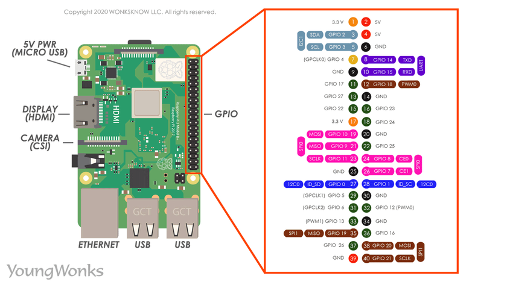
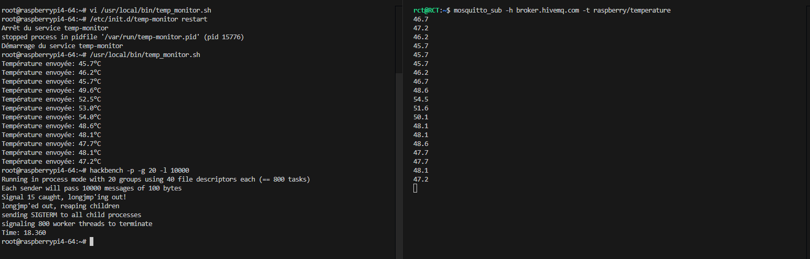
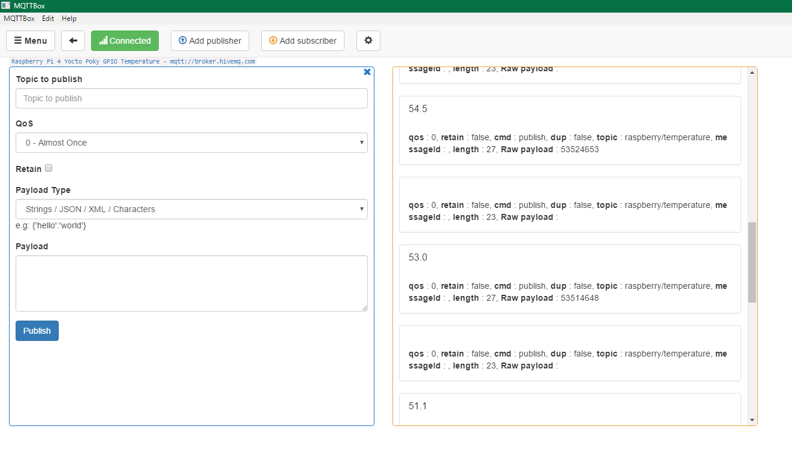
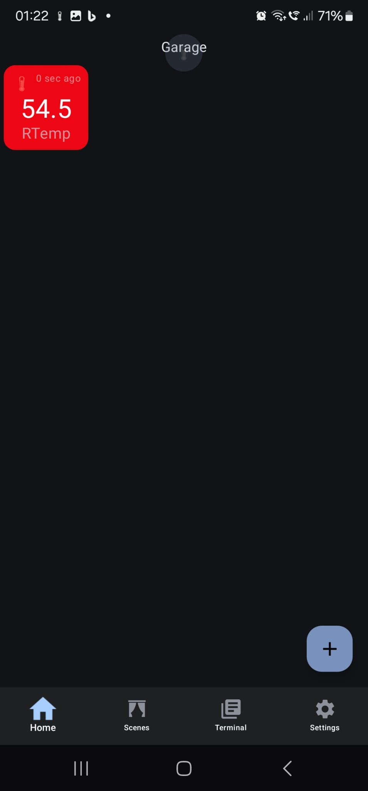

# 🌡️ Surveillance de Température sur Raspberry Pi 4 avec Yocto

<div align="center" style="bold; font-size: 24px; margin-bottom: 20px;">
<!--  -->
Roland Cédric TAYO - INEM
</div>

</br>

Ce projet implémente un système de surveillance de température CPU sur Raspberry Pi 4 utilisant Yocto Poky. Le système envoie les données de température via MQTT et intègre un mécanisme de sécurité qui arrête les processus intensifs si la température dépasse un seuil critique.

## 📋 Table des matières

1. [Installation de l'image Yocto](#💾-1-installation-de-limage-yocto-sur-la-carte-sd)
2. [Configuration du réseau Wi-Fi](#📡-2-configuration-du-réseau-wi-fi)
3. [Script de surveillance de la température](#📊-3-script-de-surveillance-de-la-température)
4. [Création du service SysVInit](#⚙️-4-création-du-service-sysvinit )
5. [Test du système](#🧪-5-test-du-système)
6. [Recette Yocto (optionnel)](#🧩-6-recette-yocto-optionnel)
7. [Environnement de développement](#💻-7-environnement-de-développement)
8. [Configuration matérielle](#🔌-8-configuration-matérielle)
9. [Visualisation des données](#📱-9-visualisation-des-données)
10. [Résolution des problèmes courants](#❓-10-résolution-des-problèmes-courants)
11. [Contacts et ressources](#📞-11-contacts-et-ressources)

## 💾 1. Installation de l'image Yocto sur la carte SD

```bash
# Décompresser l'image
bunzip2 image-yocto.wic.bz2

# Identifier le nom de périphérique de votre carte SD
lsblk

# Démonter la carte SD si elle est montée
umount /media/<votre-nom>/*

# Flasher l'image sur la carte SD
sudo dd if=image-yocto.wic of=/dev/mmcblk0 bs=1M
```

**Note**: Remplacez `/dev/mmcblk0` par le nom correct de votre périphérique SD (vérifiez avec `lsblk`).

## 📡 2. Configuration du réseau Wi-Fi

Une fois que la Raspberry Pi démarre avec l'image Yocto:

```bash
# Générer la configuration pour votre réseau Wi-Fi
wpa_passphrase "NomDeVotreReseau" "MotDePasse" >> /etc/wpa_supplicant.conf

# Activer l'interface Wi-Fi
ifup wlan0

# Vérifier la connexion 
ping google.fr
```

Pour que le Wi-Fi se connecte automatiquement au démarrage, modifiez le fichier `/etc/network/interfaces`:

```bash
# Éditer le fichier
nano /etc/network/interfaces

# Remplacer/ajouter ces lignes
#auto eth0
auto wlan0
```

**Note**: Une fois la configuration réseau terminée, vous pouvez vous connecter à la Raspberry Pi via SSH pour les opérations suivantes.

## 📊 3. Script de surveillance de la température

Créez un script pour surveiller la température et l'envoyer via MQTT:

```bash
# Créer un répertoire pour le script
mkdir -p /usr/local/bin

# Créer le script
nano /usr/local/bin/temp_monitor.sh
```

Contenu du script:

```bash
#!/bin/sh

# Configuration
BROKER="broker.hivemq.com"  # Adresse du broker MQTT
TOPIC="raspberry/temperature"  # Sujet MQTT
INTERVAL=5  # Intervalle en secondes
MAX_TEMP=55000  # Température maximale en millièmes de degrés (55°C)

while true; do
    # Lire la température
    TEMP=$(cat /sys/class/hwmon/hwmon0/temp1_input)
    
    # Convertir en degrés Celsius pour l'affichage
    TEMP_C="$(($TEMP / 1000)).$(($TEMP % 1000 / 100))"
    
    # Envoyer via MQTT
    mosquitto_pub -h $BROKER -t $TOPIC -m "$TEMP_C"
    
    echo "Température envoyée: $TEMP_C°C"
    
    # Vérifier si la température dépasse le maximum
    if [ $TEMP -gt $MAX_TEMP ]; then
        echo "ALERTE! Température trop élevée ($TEMP_C°C). Arrêt de hackbench."
        killall hackbench
        mosquitto_pub -h $BROKER -t "$TOPIC/alert" -m "Température maximum dépassée: $TEMP_C°C"
    fi
    
    # Attendre l'intervalle spécifié
    sleep $INTERVAL
done
```

Rendez le script exécutable:

```bash
chmod +x /usr/local/bin/temp_monitor.sh
```

## ⚙️ 4. Création du service SysVInit 

Créez un script de démarrage pour le service:

```bash
# Créer le script de service
nano /etc/init.d/temp-monitor
```

Contenu du script:

```bash
#!/bin/sh
### BEGIN INIT INFO
# Provides:          temp-monitor
# Required-Start:    $network $remote_fs
# Required-Stop:     $network $remote_fs
# Default-Start:     2 3 4 5
# Default-Stop:      0 1 6
# Short-Description: Service de surveillance de température
### END INIT INFO

DAEMON="/usr/local/bin/temp_monitor.sh"
DAEMON_NAME="temp-monitor"

# Exit if the package is not installed
[ -x "$DAEMON" ] || exit 0

case "$1" in
  start)
    echo "Démarrage du service $DAEMON_NAME"
    start-stop-daemon --start --background --make-pidfile --pidfile /var/run/$DAEMON_NAME.pid --exec $DAEMON
    ;;
  stop)
    echo "Arrêt du service $DAEMON_NAME"
    start-stop-daemon --stop --pidfile /var/run/$DAEMON_NAME.pid
    ;;
  restart)
    $0 stop
    $0 start
    ;;
  status)
    if [ -e /var/run/$DAEMON_NAME.pid ]; then
      echo "$DAEMON_NAME est en cours d'exécution"
    else
      echo "$DAEMON_NAME n'est pas en cours d'exécution"
    fi
    ;;
  *)
    echo "Utilisation: /etc/init.d/$DAEMON_NAME {start|stop|restart|status}"
    exit 1
    ;;
esac

exit 0
```

Rendez le script exécutable et activez-le au démarrage:

```bash
chmod +x /etc/init.d/temp-monitor
update-rc.d temp-monitor defaults
```

## 🧪 5. Test du système

Pour tester le système complet:

1. Démarrez le service de surveillance:
   ```bash
   /etc/init.d/temp-monitor start
   ```

2. Sur votre PC ou téléphone, installez un client MQTT et abonnez-vous au sujet `raspberry/temperature`:
   ```bash
   mosquitto_sub -h broker.hivemq.com -t raspberry/temperature
   ```

3. Lancez le test de charge pour augmenter la température:
   ```bash
   hackbench -p -g 20 -l 10000
   ```

4. Observez comment la température augmente puis redescend une fois que le script tue le processus hackbench.

## 🧩 6. Recette Yocto (optionnel)

Pour créer une recette d'image personnalisée:

1. Créez un répertoire pour votre layer personnalisé:
   ```bash
   mkdir -p ~/poky/meta-custom/recipes-core/images
   mkdir -p ~/poky/meta-custom/recipes-custom/temp-monitor
   ```

2. Créez la recette pour le script de surveillance:
   ```bash
   nano ~/poky/meta-custom/recipes-custom/temp-monitor/temp-monitor_1.0.bb
   ```

   Contenu:
   ```
   SUMMARY = "Temperature monitoring script"
   DESCRIPTION = "Script that monitors CPU temperature and sends data via MQTT"
   LICENSE = "MIT"
   LIC_FILES_CHKSUM = "file://${COMMON_LICENSE_DIR}/MIT;md5=0835ade698e0bcf8506ecda2f7b4f302"

   inherit update-rc.d

   INITSCRIPT_NAME = "temp-monitor"
   INITSCRIPT_PARAMS = "defaults 90"

   SRC_URI = "file://temp_monitor.sh \
              file://temp-monitor"

   S = "${WORKDIR}"

   do_install() {
       install -d ${D}${bindir}
       install -m 0755 ${S}/temp_monitor.sh ${D}${bindir}/

       install -d ${D}${sysconfdir}/init.d
       install -m 0755 ${S}/temp-monitor ${D}${sysconfdir}/init.d/temp-monitor
   }

   RDEPENDS:${PN} += "mosquitto-clients"
   ```

3. Créez le répertoire pour les fichiers sources:
   ```bash
   mkdir -p ~/poky/meta-custom/recipes-custom/temp-monitor/files
   ```

4. Copiez les scripts que vous avez créés précédemment:
   ```bash
   cp /usr/local/bin/temp_monitor.sh ~/poky/meta-custom/recipes-custom/temp-monitor/files/
   cp /etc/init.d/temp-monitor ~/poky/meta-custom/recipes-custom/temp-monitor/files/
   ```

5. Créez la recette d'image:
   ```bash
   nano ~/poky/meta-custom/recipes-core/images/temp-monitor-image.bb
   ```

   Contenu:
   ```
   require recipes-core/images/core-image-base.bb

   SUMMARY = "Custom image with temperature monitoring"

   IMAGE_INSTALL:append = " \
       rt-tests \
       mosquitto-clients \
       temp-monitor \
   "
   ```

6. Créez le fichier de configuration du layer:
   ```bash
   nano ~/poky/meta-custom/conf/layer.conf
   ```

   Contenu:
   ```
   # We have a conf and classes directory, add to BBPATH
   BBPATH .= ":${LAYERDIR}"

   # We have recipes-* directories, add to BBFILES
   BBFILES += "${LAYERDIR}/recipes-*/*/*.bb \
               ${LAYERDIR}/recipes-*/*/*.bbappend"

   BBFILE_COLLECTIONS += "meta-custom"
   BBFILE_PATTERN_meta-custom = "^${LAYERDIR}/"
   BBFILE_PRIORITY_meta-custom = "10"

   LAYERDEPENDS_meta-custom = "core"
   LAYERSERIES_COMPAT_meta-custom = "dunfell kirkstone"
   ```

7. Ajoutez votre layer à la configuration de build:
   ```bash
   bitbake-layers add-layer ~/poky/meta-custom
   ```

8. Construisez l'image:
   ```bash
   bitbake temp-monitor-image
   ```

## 💻 7. Environnement de développement

Pour ce projet, l'environnement de développement suivant a été utilisé:

- **Système d'exploitation**: Windows SE avec WSL (Windows Subsystem for Linux)
- **Framework Yocto**: Poky
- **Broker MQTT**: Mosquitto (installé sur WSL)
- **Accès à la Raspberry Pi**: Via SSH

La configuration de Mosquitto sur WSL est nécessaire pour tester la réception des données de température localement avant de déployer le système sur la Raspberry Pi.

## 🔌 8. Configuration matérielle

### Connexion série avec adaptateur PL2303HXA

Pour communiquer avec la Raspberry Pi via le port série, un adaptateur USB-TTL PL2303HXA a été utilisé. Ce modèle étant ancien (abandonné depuis 2012), l'installation d'un pilote spécifique est nécessaire sur Windows:

1. Téléchargez le pilote depuis [ce lien](https://www.mediafire.com/file/982x6iyk89v95dp/Prolific_PL2303_driver_v3.3.2.102_%25282008-24-09%2529_Win8_x64_x86.7z/file)
2. Suivez les instructions d'installation disponibles sur le [blog officiel de Microsoft](https://answers.microsoft.com/en-us/windows/forum/all/pl2303hxa-phased-out-since-2012-version-38310/2ef1d8fa-59fc-421e-9510-b1f63c68d4f9)

### Branchement sur la Raspberry Pi 4

Connectez l'adaptateur série à la Raspberry Pi comme suit:

- Fil noir (GND) → Pin 6 (GND)
- Fil blanc (TX) → Pin 8 (GPIO14)
- Fil vert (RX) → Pin 10 (GPIO15)
- Ne pas connecter le fil rouge (5V)
- Alimentation via le micro USB de la Raspberry Pi (5V)


<!--  -->

## 📱 9. Visualisation des données

Les données de température peuvent être visualisées de plusieurs façons:

### Sur Console : WSL & Rasspberry Pi 4 via SSH

Mosquitto a été utilisé sur wsl pour s'abonner au topic MQTT et visualiser les données de température en temps réel:




### Sur PC (Windows/WSL)

MQTTBox a été utilisé pour s'abonner au topic MQTT et visualiser les données de température en temps réel:



### Sur smartphone Android

L'application "MQTT Client" permet de recevoir les données de température sur un appareil mobile:

1. Configurez l'application pour se connecter au broker `broker.hivemq.com`
2. Abonnez-vous au topic `raspberry/temperature`
3. Créez un widget pour afficher les données en temps réel sur l'écran d'accueil


Le widget a été configuré pour envoyer des notifications selon certains seuils de température:
- Notification d'alerte si la température dépasse 50°C
- Notification d'information pour les températures entre 40°C et 50°C

<!--  -->


## ❓ 10. Résolution des problèmes courants

- **Problème**: Le Wi-Fi ne se connecte pas
  **Solution**: Vérifiez que le fichier wpa_supplicant.conf est correct et que le SSID/mot de passe sont valides.

- **Problème**: L'interface MQTT ne fonctionne pas
  **Solution**: Assurez-vous que le broker MQTT est installé et en cours d'exécution avec `systemctl status mosquitto`.

- **Problème**: Le script ne tue pas hackbench
  **Solution**: Vérifiez les droits d'exécution du script et assurez-vous que la valeur MAX_TEMP est appropriée.

- **Problème**: L'adaptateur série PL2303HXA n'est pas reconnu
  **Solution**: Assurez-vous d'avoir installé le pilote correct

## 📞 11. Contacts et ressources

#### Roland Cédric TAYO
[](https://www.linkedin.com/in/rct/)
[](https://github.com/rolln7drktayau/)

### Encadrement - Pierre FICHEUX

[](https://www.linkedin.com/in/pierre-ficheux-662904/)

---

*Ce projet a été développé dans le cadre d'un TP à rendre pour le cadre de l'UE "Architecture des systèmes embarqués" de CY Tech S/C CY Paris Université.*
